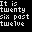

# Internet-of-Things RGB LED Matrix via Sockets

    

This project in the continuation of the [IoT RGB LED Matrix](https://github.com/Nurgak/IoT-RGB-LED-Matrix). Socket communication is used, instead of Node-RED/MQTT, for a much faster update rate, allowing to display remotely generated animations. The [Adafruit LED Matrix library](https://github.com/adafruit/RGB-matrix-Panel) is used to take advantage of its incredibly optimized display update routine.

The ESP32 acts as the socket server, anything that is recieved from a client is directly read to the screen buffer. Therefore, the data packing must be done on the client side. Having the ESP32 as the server and the Python side the client allows to send data only when needed - when screen needs to be updated with new data.

Because of the way the data is handled in the Adafruit LED Matrix library, only the 3 most significant bits (MSB) are used for the display, allowing _only_ 8 shades per color channel, or 8^3=512 colors. Therefore, when creating animations, one must keep in mind that only the 3 MSB are actually relevant.

All code, animations and options are [extensively documented using Doxygen](https://nurgak.github.io/IoT-RGB-LED-Matrix-Socket/).

## Example animations

Having the client written in Python makes it straight forward to create generated animations using standard libraries and image processing tools, such as Numpy and OpenCV, and link them to various APIs (weather data, mail service...) and display them quickly.

To display an animation on the matrix call the following command

    client/main.py $ANIMATION [OPTIONS] display $HOST_IP

For example

    client/main.py analog_clock.AnalogClock --timezone Asia/Tokyo display 192.168.3.15

| Animation | Preview | Command |
| --- | --- | --- |
| Analog clock animation |  | `analog_clock.AnalogClock -t Asia/Tokyo`
| Conway's Game of Life in color |  | `game_of_life.GameOfLifeColor`
| Conway's Game of Life fast |  | `game_of_life.GameOfLifeFast`
| Digital data display |  | `digital_data.DigitalData -t Asia/Tokyo -c Tokyo -k $OWM_API_KEY`
| Generated fire animation |  | `fire.Fire`
| English word clock |  | `word_clock.English -t Asia/Tokyo`
| Japanese word clock |  | `word_clock.Japanese -t Asia/Tokyo`
| Growing tree maze generator |  | `rgb.GrowingTree`
| Hilbert curve animation |  | `rgb.HilbertCurve`
| Mandelbrot fractal animation |  | `rgb.Mandelbrot`
| Static QR code |  | `qr_code.QRCode --text "test"`
| Generated water drop animation |  | `water.Water`
| Generated falling snow animation |  | `snow.Snow`
| Matrix rain animation |  | `matrix.Matrix --text "test"`

## Hardware

An ESP32 breakout board was used in this project with a [custom adapter PCB](https://hackaday.io/project/28945-iot-rgb-led-matrix-controller-esp32). Although the adapter is not strictly necessary as the ESP32 breakout can be connected to the RGB LED matrix with some cables just as well.

### Pinout

The pin assignment is not strict and every pin can be reconfigured to another one, but it is recommended to follow the pinout below so it would work with the unmodified code. The only requirement is to have 13 GPIO available.

<table>
    <tr>
        <th>Pin</th>
        <th>GPIO</th>
        <th>Reference</th>
    </tr>
    <tr>
        <td>OE</td>
        <td>13</td>
        <td rowspan="13"></td>
    </tr>
    <tr>
        <td>CLK</td>
        <td>14</td>
    </tr>
    <tr>
        <td>LAT</td>
        <td>15</td>
    </tr>
    <tr>
        <td>CH_A</td>
        <td>26</td>
    </tr>
    <tr>
        <td>CH_B</td>
        <td>4</td>
    </tr>
    <tr>
        <td>CH_C</td>
        <td>27</td>
    </tr>
    <tr>
        <td>CH_D</td>
        <td>2</td>
    </tr>
    <tr>
        <td>R1</td>
        <td>5</td>
    </tr>
    <tr>
        <td>G1</td>
        <td>17</td>
    </tr>
    <tr>
        <td>BL1</td>
        <td>18</td>
    </tr>
    <tr>
        <td>R2</td>
        <td>19</td>
    </tr>
    <tr>
        <td>G2</td>
        <td>16</td>
    </tr>
    <tr>
        <td>BL2</td>
        <td>25</td>
    </tr>
</table>

## Software

### Dependencies

The ESP32 is programmed via Arduino IDE and needs the following libraries

* https://github.com/adafruit/RGB-matrix-Panel
* https://github.com/adafruit/Adafruit-GFX-Library
* https://github.com/adafruit/Adafruit_BusIO
* https://www.arduino.cc/reference/en/libraries/wifimanager/

### Firmware

The ESP32 needs to have its firmware uploaded before it can recieve the data stream from the client (Python script). The client must be on the same network and be provided with the IP of the ESP32.

The firmware upload can be done using [Arduino IDE together with the ESP32 board definitions](https://docs.espressif.com/projects/arduino-esp32/en/latest/installing.html#installing-using-boards-manager).

The board must be configured as follows from the `Tools` menu in Arduino IDE:
* Board: ESP32 Dev Module
* CPU Frequency: 240MHz
* Flash Frequency: 80MHz
* Flash size: 4MB (32Mb)
* Partition Scheme: Default 4MB with spiffs
* Core Debul Level: None
* PSRAM: Disabled

The WiFi credentials need to be entered once using the WiFi access point created by the ESP32 (named `ESPLEDMATRIX-XXXXXX`), from the address http://192.168.4.1. Once connected to the local WiFi the access point no longer works.

Upon a successful connection to the local WiFi network the matrix displays its IP address.

Once the firmware is uploaded the ESP32 can be reprogrammed using over-the-air (OTA) updating by selecting the new port from `Tools`, the password is the same as the module name (`ESPLEDMATRIX-XXXXXX`).

### Fonts

The fonts used in this project are property of their respective creators. As they are free to be redistributed they are also bundeled with this project, but they have their own licenses distinct from this project.

* [Small 5x3 Regular](https://fontsup.com/font/small-5x3-regular.html) by [Soxhead2000](https://fontsup.com/designer/soxhead2000.html) ([CC BY-SA](http://creativecommons.org/licenses/by-sa/3.0/))
* [Misaki Font](https://littlelimit.net/misaki.htm) by [門真 なむ](https://littlelimit.net/about.htm) ([free software](https://littlelimit.net/font.htm#license))

## Usage

### Main

The `main.py` file, in the `client` directory, imports all the example animations and allows to configure and launch them. This is the beginning of all execution.

The `-h` flag displays how to use it.

    client/main.py -h

Some animations have extra arguments, such as the time zone for the clocks. See the usage for specific animations in the examples section.

#### Display

To display the animation on an RGB LED Matrix add the `display` suffix with the IP of the ESP32.

    client/main.py $ANIMATION display $HOST_IP

#### Saving

To save an animation to a file add the `save` suffix with the number of frames to save. One frame will result in a static `png`, more will be saved as a `gif`. The image file name will be `$ANIMATION.png/gif`.

    client/main.py $ANIMATION save $FRAMES

The saving script acts as a virtual display, decoding the encoded frame as the actual display would. Therefore, as with the real display, only the 3 MSB of the color are relevant.

### Docker

An effective way to run the client side is to use Docker. This is a prepared and tested environment where all the dependencies are already installed.

The Docker image was specifically prepared to be (also) compatible with `arm32v7` architecture, so it would run on a SOC such as a Raspberry Pi.

#### Build

    docker build -t iot_rgb_led_matrix .

#### Run

This command will run the `AnalogClock` animation by default, other parameters are available (check the `Dockerfile`).

    docker run -it --rm -e HOST_IP=192.168.3.15 iot_rgb_led_matrix

#### Docker compose

Docker compose allows to configure and run the script, in the Docker container, in the background (`-d` flag for the detach) as well as make sure the Docker instance restarts upon reboot. See the `docker-compose.yml` file for details.

    docker-compose up -d

To stop the docker container call the following

    docker-compose down

## Notes

* This project has only been tested with a 32x32 RGB LED matrix panel.
* The recommended panel is an official [Adafruit one](https://www.adafruit.com/product/607). Cheaper can be had, but experience has shown major luminosity degradation and burn-in issues with those.
* It can happen that the matrix freezes (the client is unable to send new data to the matrix). To prevent the matrix from showing an invalid state the watchdog restarts the ESP if no new data has been recieved for 2 minutes. Depeding on the usage, this behaviour might not be desired and can be disabled.

## License

This project is published under the [MIT license](LICENSE).
