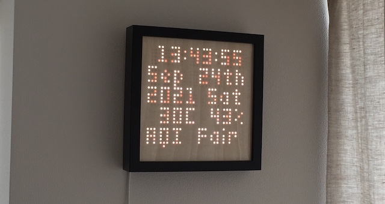

# Internet-of-Things RGB LED Matrix via Sockets

This project in the continuation of the [IoT RGB LED Matrix](https://github.com/Nurgak/IoT-RGB-LED-Matrix). Socket communication is used, instead of Node-RED/MQTT, for a much faster update rate. The [Adafruit LED Matrix library](https://github.com/adafruit/RGB-matrix-Panel) is used to take advantage of its incredibly optimized display update routine.

The ESP32 acts as the socket server, anything that is recieved from a client is directly read to the screen buffer. Therefore, the data packing must be done on the client side. Having the ESP32 as the server and the Python side the client allows to send data only when needed - when screen needs to be updated with new data.

Because of the way the data is compressed, only the 3 most significant bits are used for the display, allowing _only 8_ shades per color channel, or 8^3=512 colors.

Code has been [extensively documented using Doxygen]().

## Example animations

Having the client written in Python makes it straight forward to create animations using standard image processing tools, such as OpenCV, and link them to various APIs and display them quickly.

A list of examples have been prepared. To view any of the examples execute them using the example command in the list. The environment variable `$HOST_IP` represents the ESP32 IP address.

| Animation | Description | Example | Command |
| --- | --- | --- | --- |
| Analog clock | A face emulating an analog clock with hour, minute and second hands. Optionally, the [time zone](https://en.wikipedia.org/wiki/List_of_tz_database_time_zones) can be set, defaulting to GMT when not defined. |  | `./main.py AnalogClock --timezone Asia/Tokyo display $HOST_IP`
| Conway's Game of Life in Color | [Cellular automaton](https://en.wikipedia.org/wiki/Conway's_Game_of_Life) iterative animation based on its state and some simple rules. A new pixel adopts the average color of its adjacent parents. |  | `./main.py GameOfLifeColor display $HOST_IP` |
| Conway's Game of Life fast | Same as the previous animation, but only in one color and optimized for speed. |  | `./main.py GameOfLifeFast display $HOST_IP` |
| Digital data | Display various data in digital format, using [OpenWeatherMap API](https://openweathermap.org/api) and the *Small 5x3* font. The extra arguments are the [OWM API key](https://openweathermap.org/api), the [timezone](https://en.wikipedia.org/wiki/List_of_tz_database_time_zones) and the [city](https://openweathermap.org/current#name) information for the temperature, humidity and air pollution data. |  | `./main.py DigitalData --key $OWM_API_KEY -t Asia/Tokyo -c Tokyo display $HOST_IP` |
| Fire | A simplistic fire animation. |  | `./main.py Fire display $HOST_IP` |
| English word clock | Time, but written in English. Using the *Small 5x3* font. |  | `./main.py WordClockEnglish -t Asia/Tokyo display $HOST_IP` |
| Japanese word clock | Time, but written in Japanese Kanji using the *Misaki Font*. |  | `./main.py WordClockJapanese -t Asia/Tokyo display $HOST_IP` |
| Maze generator | A maze generator based on the [Growing Tree algorithm](https://weblog.jamisbuck.org/2011/1/27/maze-generation-growing-tree-elgorithm), implemented as a recursive function. |  | `./main.py MazeGrowingTree display $HOST_IP` |
| QR code | Text converted to QR code. |  | `./main.py QRCode --text "test" display $HOST_IP` |
| Water | A water drop animation. |  | `./main.py Water display $HOST_IP` |

## Hardware

An ESP32 breakout board was used in this project with a [custom adapter PCB](https://hackaday.io/project/28945-iot-rgb-led-matrix-controller-esp32). Although the adapter is not necessary as the ESP32 breakout can be connected to the RGB LED matrix with some cables just as well.

### Pinout

The pin assignment is not strict and every pin can be reconfigured to another one, but it is recommended to follow the pinout below so it would work with the unmodified code.

<table>
    <tr>
        <th>Pin</th>
        <th>GPIO</th>
        <th>Reference</th>
    </tr>
    <tr>
        <td>OE</td>
        <td>13</td>
        <td rowspan="13"></td>
    </tr>
    <tr>
        <td>CLK</td>
        <td>14</td>
    </tr>
    <tr>
        <td>LAT</td>
        <td>15</td>
    </tr>
    <tr>
        <td>CH_A</td>
        <td>26</td>
    </tr>
    <tr>
        <td>CH_B</td>
        <td>4</td>
    </tr>
    <tr>
        <td>CH_C</td>
        <td>27</td>
    </tr>
    <tr>
        <td>CH_D</td>
        <td>2</td>
    </tr>
    <tr>
        <td>R1</td>
        <td>5</td>
    </tr>
    <tr>
        <td>G1</td>
        <td>17</td>
    </tr>
    <tr>
        <td>BL1</td>
        <td>18</td>
    </tr>
    <tr>
        <td>R2</td>
        <td>19</td>
    </tr>
    <tr>
        <td>G2</td>
        <td>16</td>
    </tr>
    <tr>
        <td>BL2</td>
        <td>25</td>
    </tr>
</table>

## Installation

### Dependencies

The ESP32 is programmed via Arduino IDE and needs the following libraries

* https://github.com/adafruit/RGB-matrix-Panel
* https://github.com/adafruit/Adafruit-GFX-Library
* https://github.com/adafruit/Adafruit_BusIO

### Firmware

The ESP32 needs to have its firmware uploaded before it can recieve the data stream from the client. The client must be on the same network and be provided with the IP of the ESP32. The IP is displayed on the LED matrix when it starts up.

The WiFi credentials need be provided in the `config.h` file.

### Fonts

The fonts used in this project are property of their respective creators. As they are free to be redistributed they are also bundeled with this project, but they have their own licenses distinct from this project.

* [Small 5x3 Regular](https://fontsup.com/font/small-5x3-regular.html) by [Soxhead2000](https://fontsup.com/designer/soxhead2000.html) ([CC BY-SA](http://creativecommons.org/licenses/by-sa/3.0/))
* [Misaki Font](https://littlelimit.net/misaki.htm) by [門真 なむ](https://littlelimit.net/about.htm) ([free software](https://littlelimit.net/font.htm#license))

## Usage

### Main

The `main.py` file imports all the example animations and allows to configure and launch them. This is the beginning of all execution.

The `-h` flag will show how to use it. For example

    ./main.py -h

Some animations have extra arguments, such as the time zone for the clocks. See the usage for specific animations in the examples section.

#### Display

To display the animation on an RGB LED Matrix add the `display` suffix with the IP of the ESP32.

    ./main.py <Animation name> display 192.168.3.15

#### Saving

To save an animation to a file add the `save` suffix with the number of frames to save. One frame will result in a static `png`, more will be saved as a `gif`. The file name will be `<Animation name>.png/gif`.

    ./main.py <Animation name> save 1

### Docker

An effective way to run the client side is to use Docker. This is a prepared and tested environment where all the dependencies are already installed.

#### Build

    docker build -t iot_rgb_matrix_panel_client .

#### Run

    docker run -it --rm -v "$(pwd):/root/ws" \
        -p 7777:7777 \
        -e HOST_IP=192.168.3.15 \
        -e PORT=7777 \
        -e ANIMATION=AnalogClock \
        -e WIDTH=32 \
        -e HEIGHT=32 \
        iot_rgb_matrix_panel_client

## Notes

* This project has only been tested with a 32x32 RGB LED matrix panel.
* The recommended panel is an official [Adafruit one](https://www.adafruit.com/product/607). Cheaper can be had, but experience has shown major luminosity degradation and burn-in issues with those.

## License

This project is published under the [MIT license](LICENSE).

